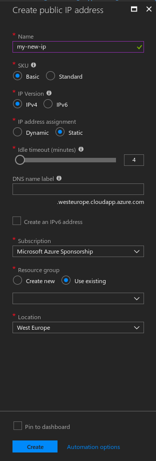

# 6. Balanceador de carga \(IP estática\)

Para asegurarnos de que Azure nos proporciona siempre la misma IP **estática** aunque nos carguemos una y otra vez el namespace y todos los recursos, lo primero que tenemos que hacer aquí es crear una nueva desde el dashboard de Azure:



Una vez la tenemos creada, ya podemos apuntar nuestro dominio a esta IP desde donde lo tenemos gestionado \(nosotros desde Route53 de AWS\).

Azure levantará un balanceador de carga nativo para nuestro servicio asignándole una IP dinámica si no se la especificamos en el fichero de configuración.



```yaml
apiVersion: v1
kind: Service
metadata:
  name: nginx-ingress-lb
  labels:
    app: nginx-ingress-lb
spec:
  externalTrafficPolicy: Local
  type: LoadBalancer
  loadBalancerIP: 13.70.230.45
  ports:
  - port: 80
    name: http
    targetPort: 80
  - port: 443
    name: https
    targetPort: 443
  selector:
    # Selects nginx-ingress-controller pods
    k8s-app: nginx-ingress-controller
```



```bash
kubectl create -f infrastructure/kubernetes/staging/routing/static-ip-svc.yaml --namespace=staging
```

Como vemos es un servicio normal solo que se especifica que se de tipo `LoadBalancer`, se especifica la IP que hemos generado previamente, que los puertos que acepta son el `80` y `443` y que el _backend_ que va a balancear se llama[`nginx-ingress-controller`](7.-nginx-ingress.md#2-nginx-ingress-controller)


Al crear un recurso nativo de Azure, el balanceador de carga puede llegar a tardar hasta 15 minutos en estar disponible.


