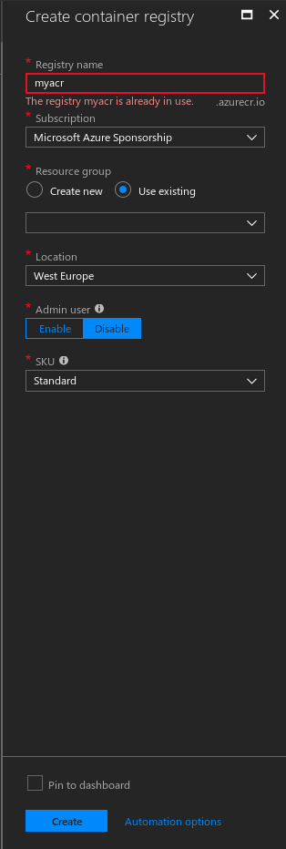

# 1. Azure

### 1. Instalar el CLI de Azure

Desde la página oficial de azure en función de tu SO elige el instalador correcto.

[https://docs.microsoft.com/en-us/cli/azure/install-azure-cli?view=azure-cli-latest](https://docs.microsoft.com/en-us/cli/azure/install-azure-cli?view=azure-cli-latest)

### 2. Login

Ejecutamos el comando de login en el CLI de azure y seguimos los pasos para introducir los credenciales.

```bash
az login
```

### 3. AKS \(Azure Kubernetes Service\)

#### 1. Activar los servicios de Azure necesarios.

Primero nos tenemos que asegurar que tenemos activados los siguientes servicios de Azure:

```bash
az provider register -n Microsoft.Network
az provider register -n Microsoft.Storage
az provider register -n Microsoft.Compute
az provider register -n Microsoft.ContainerService
```

#### 2. Creación del Resource Group.

En Azure todos los recursos se deben crear bajo un Resource Group. Cada Resource Group es independiente y no se comunican entre sí, así que **TODO** lo que quieras crear debe estar en el mismo Resource Group.

A día de hoy, se acaban de habilitar en la zona _westeurope_ las máquinas con SSD. Es algo a tener en cuenta al elegir la localización de tu Resource Group.

Creamos un resource group con el siguiente comando:

`az group create --name myResourceGroup --location westeurope`

#### 3. Creación del AKS Cluster

`az aks create --resource-group myResourceGroup --name myAKSCluster --node-count 1 --generate-ssh-keys`

Este comando creará un cluster de kubernetes en el Resource Group indicado con:

* 1 sola máquina del tamaño por defecto \(a mi me ha salido `Standard DS1 v2 (1 vcpus, 3.5 GB memory)`\)
* Una nueva clave para conectar por ssh a los nodos del cluster \(todas las máquinas que se escalen en un futuro tendrán la misma configuración\)

Se puede elegir el tamaño de la máquina con el parámetro `--node-vm-size`

Se pueden seleccionar las claves para ssh con el parámetro `--ssh-key-value /path/to/publickey`

Ver más información sobre las opciones disponibles con `az aks create -h`

#### 4. Instalación de`kubectl`\(el CLI de kubernetes\) y conectarlo con AKS.

Si no tienes instalado`kubectl`, se puede hacer fácilmente desde el CLI de Azure

`az aks install-cli`

Una vez instalado, añadimos los credenciales de nuestor cluster al CLI de Kubernetes

`az aks get-credentials --resource-group myResourceGroup --name myAKSCluster`

y ahora podremos ver los nodos de nuestro cluster

`kubectl get nodes`

Puedes ver un ejemplo de como hacer todo esto en la documentación de Microsoft que tampoco está nada mal [https://docs.microsoft.com/en-us/azure/aks/kubernetes-walkthrough](https://docs.microsoft.com/en-us/azure/aks/kubernetes-walkthrough)

### 4. ACR \(Azure Container Registry\)

Necesitaremos un Container Registry privado donde almacenar nuestras imágenes de docker que luego utilizará Kubernetes, para ello, lo creamos desde el dashboard de Azure.



Una vez creado, los credenciales de acceso estarán disponibles en la sección _**Access keys**_ de nuestro container registry

